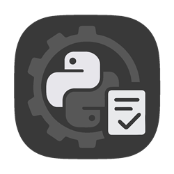

<p align="center">
  
  <br/>
</p>

<p align="center">
  <a href="https://github.com/danibcorr/python-project-template/actions/workflows/workflow.yml">
    
  </a>
  
  <a href="https://github.com/danibcorr/python-project-template/blob/main/LICENSE" target="_blank">
    
  </a>
</p>

# 🐍 Python Project Template

Python Project Template provides a ready-to-use structure for Python projects,
integrating best practices for code quality, testing, security, documentation, and
CI/CD. It helps developers start new projects quickly with a maintainable and
professional foundation.

## Features

- **Linting & Type Checking**: Ruff and Mypy for clean, consistent code.
- **Security Scanning**: Bandit detects potential vulnerabilities.
- **Code Complexity Analysis**: Complexipy identifies complex functions and modules.
- **Testing Suite**: Reliable unit testing with Pytest.
- **Auto Documentation**: MkDocs + GitHub Pages for automated docs.
- **CI/CD**: GitHub Actions automates linting, testing, and documentation deployment.

And more.

## GitHub Actions

The template includes a preconfigured GitHub Actions workflow that runs automatically on
pushes or pull requests. The workflow performs the following steps:

1. Checks out the repository and sets up Python.
2. Installs project dependencies.
3. Runs linters, type checks, security scans, and complexity analysis.
4. Executes tests with Pytest.
5. Optionally generates and deploys documentation.

This ensures every change is validated, tested, and documented automatically,
maintaining high-quality and reproducible results.

## Getting Started

Before starting, ensure that you have required Python installed and a virtual
environment set up. It is recommended to create an isolated environment (e.g., using
`venv`) to manage dependencies cleanly. Additionally, ensure that
[`uv`](https://github.com/astral-sh/uv) is installed in your environment to handle
grouped dependency installations.

### 1. Generate Your Project

Use Cookiecutter to create a new project from the template:

```bash
cookiecutter https://github.com/danibcorr/python-project-template.git
```

Follow the prompts to configure project metadata, package name, and other options.

### 2. Install Dependencies

Activate your virtual environment and install all dependencies using the included
`Makefile`:

```bash
make install
```

This installs development, testing, and documentation tools as defined in
`pyproject.toml`.

### 3. Run the Pipeline

Execute the quality pipeline, which includes linting, type checking, security analysis,
complexity checks, and test execution:

```bash
make pipeline
```

### 4. Run the Full Workflow (Optional)

To perform a complete setup including dependency installation, full quality checks, and
local documentation preview:

```bash
make all
```

This ensures that the project environment is fully prepared for development and
validation.
